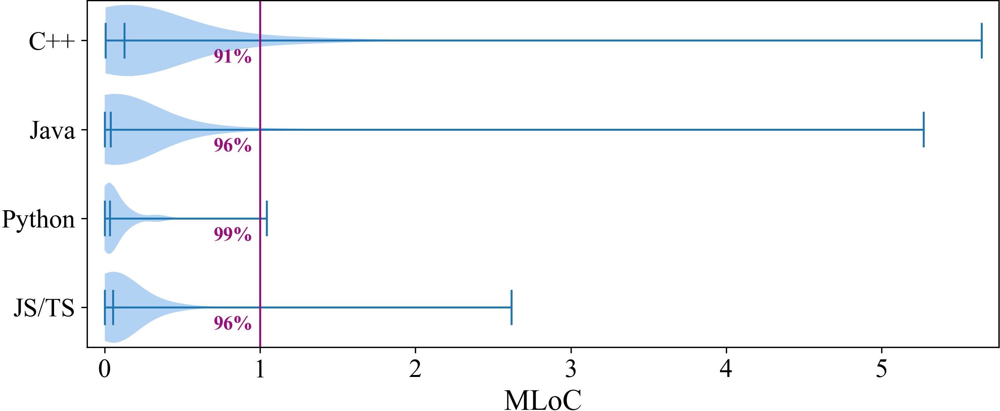

# Appendix

This appendix contains supplemental materials for clarifying.

## A. Incorrect Extraction Examples

This section lists several examples (code fragment and corresponding analyzer results) that demonstrate some entities and/or dependencies were incorrectly extracted by popular static analysis tools.

### Eg. 1: JavaScript Entity Extraction

```js
function bar({a, b: [c, {d}, ...e], f: {}, ...g}, h = 0, ...r) {
    /* Empty */
}
```

| Entity Identifier / Extracted Type | bar.a | bar.c | bar.d | bar.e | bar.g | bar.h | bar.r |
| --- | --- | --- | --- | --- | --- | --- | --- |
| ENRE | Parameter | Parameter | Parameter | Parameter | Parameter | Parameter | Parameter |
| Understand 6.2 | Variable Local | Parameter | Variable Local | Parameter | N/A | Parameter | Parameter |

> This is a complex binding pattern used to extract object properties directly from the function parameter. However, Understand shows chaotic with inconsistent entity types (which should all be `Parameter` rather than `Variable Local` or even do not extract).

### Eg. 2: JavaScript Dependency Extraction

```js
const variable = 0;

export {variable as 'a-not-valid-identifier'};

/**
 * Usage (in another file):
 * import {'a-not-valid-identifier' as ValidIdentifier} from '...';
 */
```

| Dependency | File -export→ variable |
| --- | --- |
| ENRE | √ |
| Understand 6.2 | N/A |

> This is an example of uncommon yet indeed existing syntax that popular analyzers (even JetBrains IDE and TypeScript tsc) lack support of. The `as` transform an identifier into a string literal.

### Eg. 3: C++ Entity Extraction

```cpp
using namespace std;
int main()
{
  size_t foo{0};
  return 0;
}
```

| Entity Identifier / Extracted Type | foo |
| --- | --- |
| Depends | var |
| ENRE | object |
| Sourcetrail | N/A |
| Understand (Strict) | local object |
| Understand (Fuzzy) | function |

> The declare-and-initialize syntax `foo{0}` is not supported by all tools and even results in divergent extraction in different mode.

### Eg. 4: Python Entity Extraction

```py
x = 1

y: int = 1

t1, t2 = 1, 2

(t3 := 1)
```

| Entity Identifier / Extracted Type | x | y | t1 | t2 | t3 |
| --- | --- | --- | --- | --- | --- |
| Depends | Var | Var | N/A | N/A | N/A |
| ENRE | Variable | Variable | Variable | Variable | Unknown Variable |
| SourceTrail | GLOBAL_VARIABLE | GLOBAL_VARIABLE | GLOBAL_VARIABLE | GLOBAL_VARIABLE | GLOBAL_VARIABLE |
| Understand 6.2 | python Variable Global | python Variable Global | python Variable Global | python Variable Global | python Variable Global |

> For variable declaration in Python, Depends does not support the last two patterns.

### Eg. 5: Python Dependency Extraction

```py
//// module_c.py
def func():
    ...
```

```py
//// module_d.py
def foo():
    import module_c as c
    from module_c import func

class ClassA:
    import module_c as c
```

| Dependency | foo -import-> module_c | foo -import-> func | classA -import-> module_c |
| --- | --- | --- | --- |
| Depends | N/A | N/A | N/A |
| ENRE | √ | √ | √ |
| SourceTrail | √ | √ | √ |
| Understand 6.2 | √ | √ | √ |

> For `import` used within certain scope, Depends lacks support for it and only outputs a `module_d -import-> module_c`.


## B. Model Mappings

This section first describe the mechanism of mapping different analyzers' schema into our model, and then lists mapping table for all four languages.

### Mapping mechanism

There are in total five cases we would encounter while performing the mapping.

| Case | Description |
| --- | --- |
| Ordinary | This kind of case only needs a type label mapping, that is, given the targeting language $L$, tool name $T$ and original type label $Label_{Before}$, searching in the mapping table to retrieve its corresponding mapping $Label_{After} = SearchingTable(L, T, Label_{Before})$. The entity name remains unmodified. |
| Property Extraction | This kind of case requires additional extraction from the original type label $Label_{Before}$, for example, from `Public Static Method` a `Method` entity with properties `Accessibility: Public` and `IsStatic: true` will be established, and those properties will be stored as object's properties rather than part of the label. The entity name remains unmodified. |
| Entity Name Patterns - Anonymous Entity | Different tools util various format to record anonymous entities, for example `(unnamed_class_[\d]+)` and `<anonymous[\d+]>`, and they will be converted to a unified object form for easier comparison. |
| Entity Name Patterns - Generic Symbols | One tool extracts generic entities by simply preserve `<T>` in its name while others have dedicated categories for this. When this pattern is matched, `<T>` will be removed from the name and the entity type will be changed to `Generic`. |
| Entity/Dependency Reversing | This kind of case requires additional cast that transform an entity into a dependency or vise. For example, in languages supports renaming exports, the new name (alias) can be stored either in the form an `alias` dependency or a property of `export` dependency. Since in the unified model we chose the latter one, an additional searching, converting process will be performed to transform the former format into the latter one. |

### Mapping tables

> Format declaration:
> 1. Last four columns (Depends, ENRE, SourceTrail,  Understand) contains entity/dependency TYPE LABEL produced by various tools.
> 2. Pattern `-` indicates a tool does not support this category of entity/dependency.
> 3. Pattern `- (xxx)` indicates the label `xxx` is used by tools to represent multiple categories that cannot be easily distinguished.
> 4. Pattern `{1} Template` depends ` Template` be prepended with a word (e.g., `Class`), and corresponding properties may consume this word using the form `$1`.
> 5. Pattern `√` indicates fully support. 
> 6. Pattern `Function$` requires `Function` at the end of the string.

#### C++

| Unified Model | Extra Property | Depends | ENRE | SourceTrail | Understand |
| --- | --- | --- | --- | --- | --- |
| **Entity** |
| File | | File | File | FILE | File |
| Namespace | | Namespace | Namespace | NAMESPACE | Namespace |
| Alias | | - (Alias) | Alias | - | Alias |
| Class | | - (Type) | Class | CLASS | Class |
| Struct | | - (Type) | Struct | STRUCT | Struct |
| Union | | - (Type) | Union | UNION | Union |
| Macro | | Function$ | Macro | MACRO | Macro |
| Enum | | - (Type) | Enum | ENUM$ | Enum Type |
| Enumerator | | - (Type) | Enumerator | ENUM_CONSTANT | Enumerator |
| Variable | | - (Type) | Object | VARIABLE, FIELD | | Object, Parameter |
| Function | | FunctionImpl, FunctionProto | Function | FUNCTION, METHOD | Function |
| Template | | - | {1} Template | (If entity name contains generic symbol `<>`) | {1} Template |
| | kind (class/struct/function) | - | $1 | - | $1 |
| Typedef | | - (Alias) | Typedef | TYPEDEF | Typedef Type |
| **Dependency** |
| Alias | | - | Alias | - | Alias |
| Call | | Call | Call | CALL, TEMPLATE_SPECIALIZATION | Call |
| Define | | Contain | Define | MEMBER | Define, Declare |
| Exception | | - | Exception | - | Catch Exception |
| Extend | | Extend | Extend | INHERITANCE | Base |
| Friend | | - | Friend | - | Friend |
| Include | | - | Include | INCLUDE | Include |
| Modify | | - | Modify | - | Modify |
| Override | | - | Override | OVERRIDE | Override |
| Parameter | | - | Parameter | - | - |
| Set | | - | Set | - | Set |
| Use | | Use | Use | USAGE | Use |
| Using | | - | Using | - | Using |

#### Java

| Unified Model | Extra Property | Depends | ENRE | SourceTrail | Understand |
| --- | --- | --- | --- | --- | --- |
| **Entity** |
| Package | | Package | Package | PACKAGE | Package |
| File | | File | File | FILE | File |
| Class | | - (Type) | Class | CLASS | Class |
| Enum | | - (Type) | Enum | ENUM | Enum |
| Annotation | | - (Type) | Annotation | ANNOTATION | Annotation |
| Annotation Member | | Function | Annotation Member | FIELD | - |
| Interface | | - (Type) | Interface | INTERFACE | Interface (Without `Annotation`) |
| Method | | - (Function) | Method | METHOD | Method (Without `Abstract`) |
| Module | | - | Module | - | Module |
| Record | | - | Record | - | Record |
| Type Parameter | | - | Type Parameter | TYPE_PARAMETER | TypeVariable |
| Variable | | Var | Variable | VARIABLE | Variable, Parameter |
| **Dependency** |
| Import | | Import | Import | IMPORT | Import |
| Inherit | | Inherit | Inherit | INHERITANCE | Extend |
| Implement | | Implement | Implement | - | Implement |
| Contain | | Contain | Contain | MEMBER | Contain |
| Call | | Call | Call | CALL | Call |
| Parameter | | - | Parameter | - | (Converted from `Parameter` entity) |
| Typed | | - | Typed | - | Typed |
| UseVar | | Use | UseVar | USAGE | Use |
| Set | | Set | Set | - | Set |
| Modify | | Modify | Modify | - | Modify |
| Annotate | | Annotation | Annotate | - | Annotate |
| Cast | | Cast | Cast | TYPE_USAGE | Cast |
| Override | | - | Override | OVERRIDE | Override |
| Reflect | | - | Reflect | - | - |
| Define | | Create | Define | - | Define, Declare |

#### Python

| Unified Model | Extra Property | Depends | ENRE | SourceTrail | Understand |
| --- | --- | --- | --- | --- | --- |
| **Entity** |
| Package | | Package | Package | MODULE | Package |
| Module | | File | Module | FILE | File |
| Variable | | Var | Variable | VARIABLE | Variable |
| Function | | Function | Function (Without `Anonymous`) | FUNCTION, METHOD | Function (Without `Anonymous`) |
| Parameter | | - | Parameter | - | Parameter |
| Class | | Type | Class | CLASS | Class |
| Attribute | | Attribute | Attribute | FIELD | Attribute |
| Alias | | Alias | Alias | - | Alias |
| AnonymousFunction | | - | AnonymousFunction | - | AnonymousFunction |
| **Dependency** |
| Define | | Define | Define | MEMBER | Define |
| Use | | Use | Use | USAGE | Use |
| Set | | Set | Set | - | Set |
| Import | | Import | Import | IMPORT | Import |
| Call | | Call | Call | CALL | Call |
| Inherit | | Extend | Inherit | INHERITANCE | Inherit |
| Contain | | Contain | Contain | - | Contain |
| Annotate | | Annotate | Annotate | - | Annotation |
| Alias | | Alias | Alias | - | Alias |

#### JS/TS

| Unified Model | Extra Property | ENRE | Understand |
| --- | --- | --- | --- |
| **Entity** |
| Package | | - | - |
| File | | File | File |
| Variable | | Variable | Variable |
| Function | | Function | Function |
| Parameter | | Parameter | Parameter |
| Class | | Class | Class |
| Field | | Field | {1} Property |
| | isStatic(bool) | √ | (If `Static` presents in) |
| | TSModifier(public/protected/private) | √ | $1 |
| Method | | Method | {1} Method |
| | isStatic(bool) | √ | (If `Static` presents in) |
| | TSModifier(public/protected/private) | √ | $1 |
| Property | | Property | Property |
| Namespace | | Namespace | Namespace |
| Type Alias | | Type Alias | Type Alias |
| Enum | | Enum | Enum |
| Enum Member | | Enum Member | - (Property) |
| Interface | | Interface | Interface |
| Type Parameter | | Type Parameter | Type Parameter |
| - | | - | Import Alias |
| **Dependency** |
| Import | | Import | Import |
| | alias(string) | √ | (If corresponding `Import Alias` entity exists)
| Export | | Export | Declare Export, Reexport, Define (Default) Export |
| | alias(string) | √ | (If corresponding `Alias` dependency exists)
| Call | | Call | Call |
| | withNew(bool) | - | (If `New` presents in) |
| Set | | Set | Set |
| | isInit(bool) | √ | (If `Init` presents in) |
| Use | | Use | Use |
| Modify | | Modify | Modify |
| Extend | | Extend | Extend |
| Override | | Override | Override |
| Type | | Type | Typed (The `src` and `dest` should be reversed) |
| Implement | | Implement | Implement |

## C. RQ4 Performance Evaluation

### Project size distribution

The project size of 400 projects in total are visualized as following figure. We can clearly observe that more than 91% of projects are smaller than 1MLoC.



### Raw data

The raw data is available at [RQ4/Results](./RQ4/Results/). CSV files are the corresponding statistic, where columns represents `LoC`, `<tool>-time` (in seconds) and `<tool>-memory` (in MB).

> A cell with content as -1 or 0 represents a timeout (the execution time has exceeded 30 minutes, and you may see some numbers greater than 30 minutes, that is for the test purpose and have low impact on observations).
